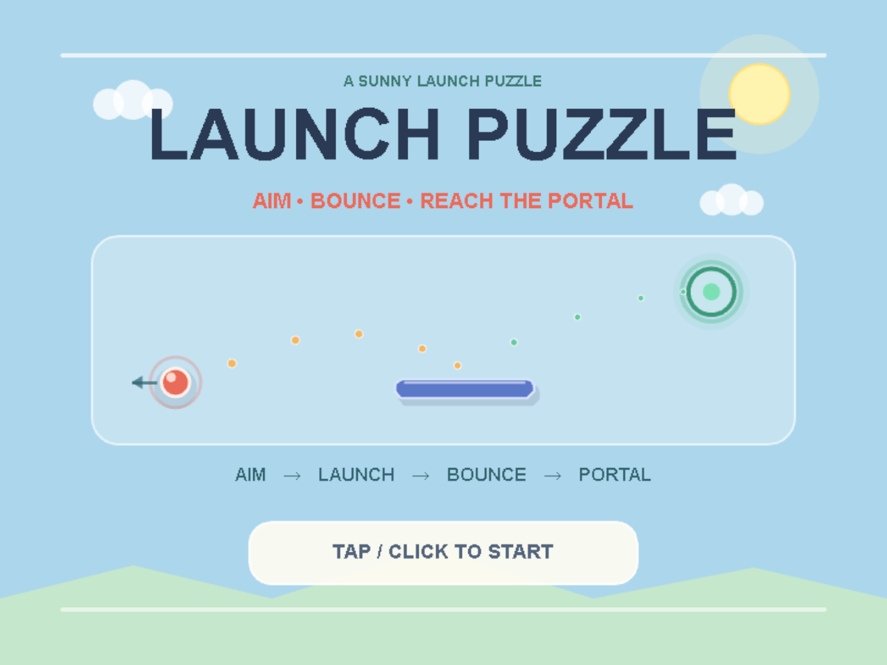
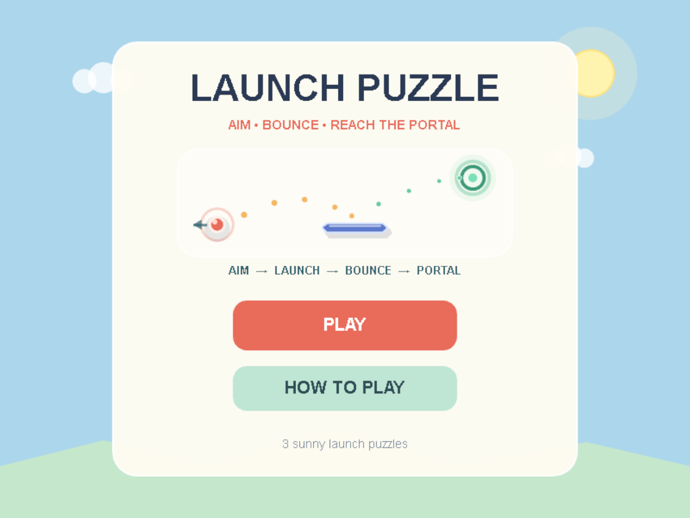
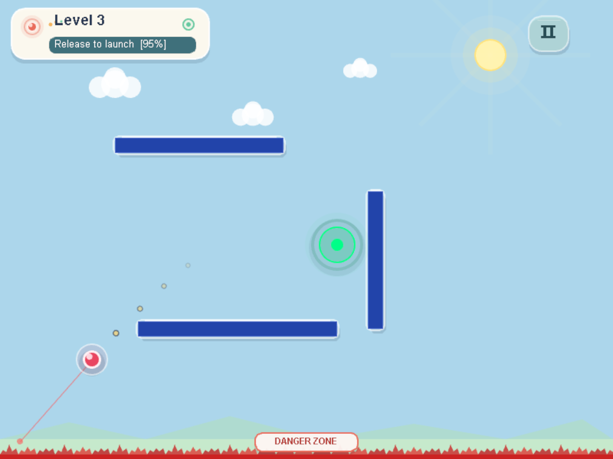
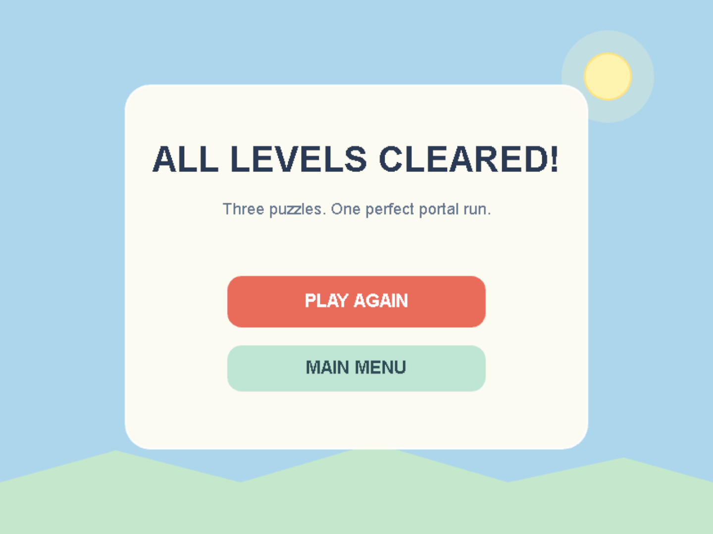

# Launch Puzzle Game

**Reverse-drag. Read the predicted path. Chain rebounds into the portal.**

A complete 2D browser puzzle built with **LayaAir 3** and **TypeScript**. Three compact levels progress from a direct shot to a platform bank shot and a multi-bounce finale, with failure/respawn, pause controls, sound, and a finished Cover → Menu → Win flow.

[▶ Play Online](https://yangyjie134.github.io/LaunchPuzzleGame/) · [🎬 Watch the 45-second Preview](https://github.com/YangYjie134/LaunchPuzzleGame/releases/download/v1.0.0/launch-puzzle-game-v1.0.0-preview.mp4) · [⬇ Download v1.0.0](https://github.com/YangYjie134/LaunchPuzzleGame/releases/tag/v1.0.0)



## The Game in 10 Seconds

1. **Drag backward** from the energy orb to aim and charge.
2. Use the red power line and **four predicted trajectory points** to read the shot.
3. Release, avoid the **Danger Zone**, and reach the portal—using walls and platforms when a direct route is impossible.

The hosted demo starts audio only after the first valid tap/click on the cover, matching browser autoplay rules.

## Three-Level Progression

| Level | Challenge | What it introduces |
|---|---|---|
| **1 — Direct Shot** | Reach the portal in one clean arc | Reverse-drag aiming, charge, trajectory preview |
| **2 — Bank Shot** | Bounce from the raised platform | Platform collision and rebound reading |
| **3 — Multi-Bounce** | Route through a three-platform layout | Chained rebounds and tighter trajectory planning |

<p align="center">
  
  
</p>

<p align="center">
  
</p>

[Watch the complete 2 minute 10 second playthrough](https://github.com/YangYjie134/LaunchPuzzleGame/releases/download/v1.0.0/launch-puzzle-game-v1.0.0-full-gameplay.mp4)

## Complete Product Flow

```text
Cover → Main Menu / How To Play → Level 1 → Level 2 → Level 3 → WinScene
```

- Cover interaction unlocks and starts BGM.
- Main Menu offers a fresh run; How To Play explains desktop and mobile input.
- Invalid shots can enter the Danger Zone, trigger failure feedback, and respawn the current level.
- Pause provides Resume, current-level Restart, Main Menu, and session-wide Mute.
- WinScene closes the three-level run with Play Again and Main Menu actions.

## Controls

| Action | Desktop | Touch |
|---|---|---|
| Open Main Menu | Click the cover | Tap the cover |
| Aim and charge | Drag backward from the orb | Drag backward with one finger |
| Launch | Release the mouse button | Lift your finger |
| Restart current level | `R` | Pause → Restart |
| Pause / resume | `P` or Pause button | Pause button |
| Mute / unmute | Pause → `MUTE: ON/OFF` | Pause → `MUTE: ON/OFF` |

## Features

- Reverse-drag launch with a visible red charge line and live Power percentage
- Four-point predicted trajectory preview
- Gravity, wall rebounds, and circle-versus-platform collision
- Danger Zone failure, one-second respawn, and level restart
- Data-driven three-level progression and portal-based completion
- Cover, Main Menu, How To Play, Pause, and WinScene presentation
- Desktop and direct touch aiming input
- BGM plus launch, collision, portal, and failure SFX
- Session-wide mute without stacking or re-unlocking BGM
- Sunny visual theme designed consistently across gameplay and UI

## Run It

### Play the hosted build

Open the [GitHub Pages demo](https://yangyjie134.github.io/LaunchPuzzleGame/).

### Run the project in LayaAir

1. Open **LayaAir IDE 3**.
2. Open `LaunchPuzzleGame-Laya/`.
3. Run or preview the project from the editor.
4. Click/tap the cover, choose **PLAY**, then drag the orb backward and release.

### Run the downloadable Web build

Download the Web ZIP from the [v1.0.0 Release](https://github.com/YangYjie134/LaunchPuzzleGame/releases/tag/v1.0.0), extract it, and serve the folder through local HTTP. Do not open `index.html` with `file://` because browser asset and audio policies expect an HTTP origin.

## Technical Design

- **LayaAir 3** handles rendering, input, UI, audio, timers, and scene mounting.
- **TypeScript** implements the gameplay, scene flow, and data model.
- A custom lightweight **PhysicsEngine** handles numerical integration and collision response; the project does not use LayaAir Box2D, `RigidBody`, or `Collider` components.
- `GameScene` owns runtime input, rendering, fixed-timestep scheduling, target detection, pause state, and level lifecycle.
- `PhysicsEngine` stays independent of LayaAir display objects.
- `LevelLoader` returns cloned level data and does not silently fall back for invalid indexes.
- `GameManager` owns the outer Cover → Menu → Game → Win product flow.

```text
LaunchPuzzleGame-Laya/
  src/
    audio/AudioManager.ts
    game/GameConfig.ts
    game/GameManager.ts
    game/GameScene.ts
    game/WinScene.ts
    levels/LevelData.ts
    levels/LevelLoader.ts
    objects/Ball.ts
    objects/Platform.ts
    objects/Target.ts
    physics/PhysicsEngine.ts
    ui/HomeUI.ts
    ui/PauseUI.ts
```

## Verification

The final portfolio package is built from source baseline `a94396ed56d9c05784878509d4c726d783b3a45b`.

The shipped product has **3 playable levels**, mobile touch input, the complete Cover → Main Menu / How to Play → Pause → Win flow, session Mute, BGM, and event-specific SFX.

- The repository's final-product verifier passes all 38 checks.
- A fresh isolated LayaAir Web build completes successfully.
- The built bundle and all five audio assets respond over local HTTP.
- An automated real-browser run reaches Cover, Main Menu, How To Play, Levels 1–3, Pause, Mute, failure/respawn, and `ALL LEVELS CLEARED!`.
- The Release provides that exact Web build plus fresh short and complete gameplay captures.

## Project Ownership

This is an independently owned personal portfolio project. The developer was responsible for requirements, gameplay and technical decisions, integration, debugging, verification, and final acceptance. AI tools were used as development assistants for analysis, implementation support, and packaging; ownership of the decisions and shipped result remains with the developer.

## Audio and Credits

`AudioManager` keeps BGM input-gated, prevents scene transitions from stacking music, and plays event-specific SFX with collision cooldown protection.

| Type / Event | Source | Author | License |
|---|---|---|---|
| BGM | [*Cozy Puzzle In-Game 3*](https://opengameart.org/content/cozy-puzzle-in-game-3) | MintoDog | CC0 |
| Launch | [Boost or Launch or Thruster Sound Effect](https://opengameart.org/content/boost-or-launch-or-thruster-sound-effect) | EZduzziteh | CC0 |
| Collision | [Metal Impact Sounds](https://opengameart.org/content/metal-impact-sounds) | BMacZero | CC0 |
| Portal clear | [Teleport](https://opengameart.org/content/teleport) | fins | CC0 |
| Failure | [Game Over](https://opengameart.org/content/game-over-10) | GreyFrogGames | CC0 |

Detailed runtime paths and integration notes are in [`LaunchPuzzleGame-Laya/docs/TECH_NOTES.md`](LaunchPuzzleGame-Laya/docs/TECH_NOTES.md). Third-party notices are in [`THIRD_PARTY_NOTICES.md`](THIRD_PARTY_NOTICES.md).

## Scope and Licensing

The intended portfolio scope is complete at three levels. Audio uses fixed in-code volumes; mute is session-only and is not persisted after refresh.

No project-wide license is currently declared. `THIRD_PARTY_NOTICES.md` documents third-party engine files, template assets, and CC0 audio; it does not grant permission to reuse the project's original code, documentation, screenshots, or game design.

---

中文简介：这是一个基于 LayaAir 3 与 TypeScript 的完整 2D 发射解谜作品。玩家反向拖拽能量球，结合蓄力线与轨迹点规划射击，通过平台和墙面反弹完成三关递进挑战；项目包含封面、主菜单、玩法说明、失败重生、暂停/重开/返回菜单/静音、BGM 与四类 SFX，以及最终通关场景。可直接通过顶部链接在线试玩、观看视频或下载最终 Web 版本。
