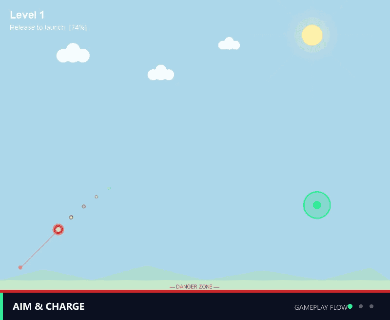
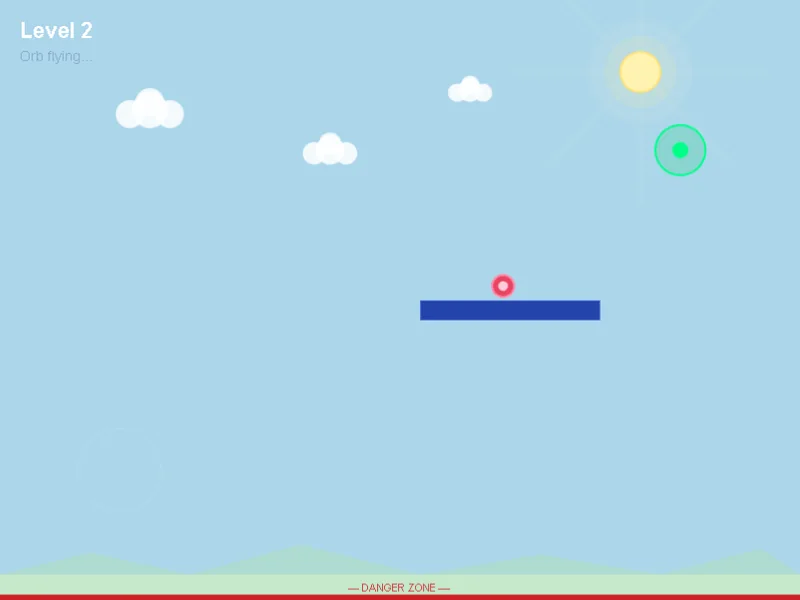
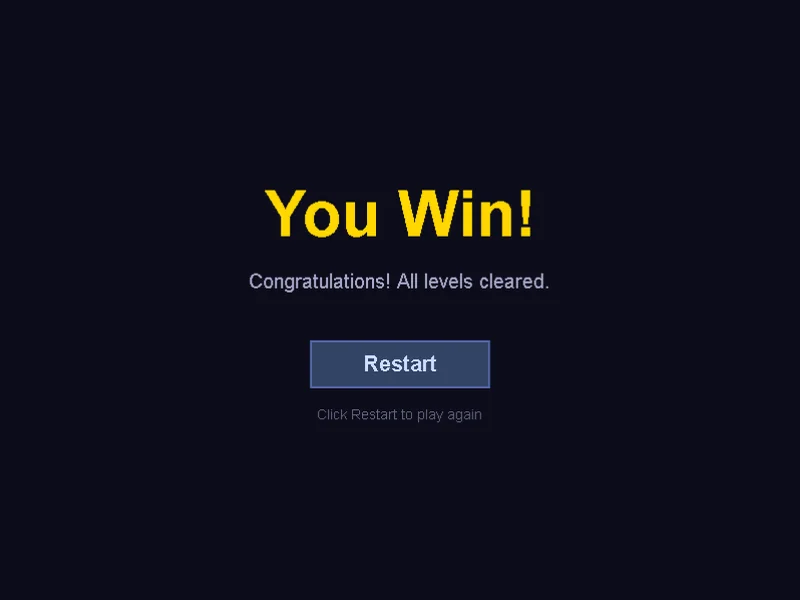

# Launch Puzzle Game

> Personal project / 个人项目 | Independently developed / 独立开发



*Gameplay flow preview assembled from captured in-game states: aim and charge, platform bounce, and level completion.*

A small-scope 2D physics launch puzzle built with **LayaAir 3** and **TypeScript**.

Players drag backward to aim and launch an energy ball, then use gravity, wall bounces, platform collisions, and portal targets to complete each level.

This project focuses on a complete playable loop, custom lightweight physics, level data loading, scene switching, and simple visual polish. It is a personal learning and portfolio project rather than a commercial release. Requirements, technical decisions, code integration, debugging, verification, and final acceptance were handled independently; AI tools were used as development assistants.

<p align="center">
  
  
</p>

## Play Online

- **Browser demo:** [Play Launch Puzzle Game](https://yangyjie134.github.io/LaunchPuzzleGame/)
- **Downloadable Web build:** [Latest GitHub Release](https://github.com/YangYjie134/LaunchPuzzleGame/releases/latest)

The hosted demo is served through GitHub Pages. Audio begins after the first valid tap/click on the cover because browsers restrict autoplay.

中文说明：可直接通过上方链接在线试玩；浏览器首次在封面进行有效点击或触摸后开始播放背景音乐。

---

## Features

- Reverse drag launch
- Aim preview trajectory
- Gravity-based ball movement
- Wall bounce
- Platform collision
- Ground failure and respawn
- Portal-based level completion
- Cover → Main Menu → Gameplay → Win product flow
- Main Menu with fresh Level 1 start
- Built-in How to Play instructions
- Pause overlay with Resume, current-level Restart, Main Menu, and session Mute
- Data-driven level loading with `LevelData` and `LevelLoader`
- Final win screen with Play Again and Main Menu actions
- Custom lightweight `PhysicsEngine`
- Sunny morning visual theme
- Keyboard reset with `R`
- Keyboard pause/resume with `P`
- Mobile direct drag, aim, and release input with a larger invisible acquisition radius
- Background music (BGM) started by the first valid cover interaction
- Sound effects (SFX) for launch, collision, portal clear, and failure
- Global session mute shared across menu, gameplay, pause, and win states

---

## Controls

| Action | Input |
|---|---|
| Open Main Menu | Tap/click the cover |
| Start aiming | Mouse down or touch near the ball |
| Aim and charge | Drag opposite the launch direction |
| Launch | Release mouse or touch |
| Reset current level | Press `R` |
| Pause / resume | Press `P` or use the Pause button |
| Mute / unmute | Open Pause and use `MUTE: ON/OFF` |

---

## How to Run

1. Open **LayaAir IDE 3**.
2. Open the `LaunchPuzzleGame-Laya/` project folder.
3. Run or preview the project from the editor.
4. Tap/click the cover, choose **PLAY**, then drag the orb directly with a mouse or one finger.
5. Press `R` to restart the current level or `P` to pause/resume.

For the downloadable Web build, extract the Release archive and serve it through local HTTP instead of opening it with `file://`. The hosted GitHub Pages build is linked in **Play Online** above.

中文说明：使用 LayaAir 3 IDE 打开 `LaunchPuzzleGame-Laya/` 后可运行主场景；也可直接在线试玩。下载版 Web 构建应通过本地 HTTP 访问。

---

## Tech Stack

- **LayaAir 3**
- **TypeScript**
- **Custom lightweight PhysicsEngine**

LayaAir is used for rendering, input, UI, timer updates, scene mounting, and scene switching.

This project does **not** use LayaAir Box2D.
It does not use `RigidBody` or `Collider` components.

Physics behavior is handled by a custom lightweight `PhysicsEngine`.

---

## Current Status

Current status: **completed and archived within the intended personal-project scope**. All three levels are playable, and the final LayaAir Web build and human playtest passed. This status does not imply a commercial release.

Implemented and verified within the current scope:

- 3 playable levels
- Custom physics step integration
- Fixed timestep accumulator in `GameScene`
- Platform collision based on `Platform.getBounds()`
- Portal detection and level switching
- Final `WinScene`
- Failure and respawn flow
- Sunny morning background
- Improved aim preview visibility
- `R` key reset
- Cover, Main Menu, and How to Play presentation
- Pause/resume, current-level restart, return-to-menu, and session mute
- Direct mobile drag input with touch-friendly acquisition
- Play Again and Main Menu completion actions

Current testing has not found obvious corner-sticking or tunneling issues.

---

## Project Structure

The LayaAir project is located in:

```text
LaunchPuzzleGame-Laya/
```

Main source structure:

```text
LaunchPuzzleGame-Laya/
  src/
    game/
      GameConfig.ts     # Canvas size, drag settings, launch speed and core config
      GameManager.ts    # Level switching and WinScene management
      GameScene.ts      # Single-level runtime, input, UI, target detection and physics scheduling
      WinScene.ts       # Final win screen
    audio/
      AudioManager.ts   # BGM and gameplay SFX playback
    levels/
      LevelData.ts      # Level data structure
      LevelLoader.ts    # Level data source and loading logic
    objects/
      Ball.ts           # Ball data model
      Platform.ts       # Platform drawing and bounds export
      Target.ts         # Portal target data and drawing
    physics/
      PhysicsEngine.ts  # Custom lightweight physics step
```

## Technical Highlights

- `GameScene` handles rendering, input, UI, timer updates, and scene lifecycle.
- `PhysicsEngine` only handles numerical physics and does not depend on LayaAir display objects.
- Fixed timestep accumulation helps reduce tunneling caused by large frame intervals.
- Platform collision uses circle-rectangle bounds detection and resolution.
- `Platform` only provides drawing and bounds data.
- Target detection stays in `GameScene` to preserve the intended gameplay flow.
- `LevelLoader.get(index)` returns cloned level data and does not silently fall back on invalid indexes.
- Final completion flow is separated into `WinScene`.

## Audio and Credits

`AudioManager` manages the implemented BGM and gameplay SFX. BGM begins after the first valid cover tap/click, while scene transitions, `WinScene`, and restart flow do not stack additional music playback. The pause menu's global mute keeps the unlocked BGM session intact and does not require a second autoplay gesture after unmuting. Collision SFX consumes existing wall/platform collision signals and uses a short cooldown to avoid repeated fixed-step triggers.

| Type / Event | Source | Author | License |
|---|---|---|---|
| BGM | [*Cozy Puzzle In-Game 3*](https://opengameart.org/content/cozy-puzzle-in-game-3) | MintoDog | CC0 |
| Launch | [Boost or Launch or Thruster Sound Effect](https://opengameart.org/content/boost-or-launch-or-thruster-sound-effect) | EZduzziteh | CC0 |
| Collision | [Metal Impact Sounds](https://opengameart.org/content/metal-impact-sounds) | BMacZero | CC0 |
| Portal clear | [Teleport](https://opengameart.org/content/teleport) | fins | CC0 |
| Failure | [Game Over](https://opengameart.org/content/game-over-10) | GreyFrogGames | CC0 |

Detailed runtime paths and integration notes are recorded in [`LaunchPuzzleGame-Laya/docs/TECH_NOTES.md`](LaunchPuzzleGame-Laya/docs/TECH_NOTES.md).

## Current Limitations

- Audio uses fixed in-code volumes. Mute is session-only, with no volume slider or persistence after refresh.
- The current project scope is intentionally limited to three levels.
- The hosted build is a portfolio demo, not a commercial or store release.

## Licensing

No project-wide license is currently declared. Third-party engine files, LayaAir template assets, and CC0 audio are documented separately in [`THIRD_PARTY_NOTICES.md`](THIRD_PARTY_NOTICES.md). That notice does not grant permission to reuse the project's original code, documentation, screenshots, or game design.

---

## Notes

This project is part of a small-game practice portfolio.
The goal is not to build a large commercial game, but to demonstrate a complete, playable, explainable, and maintainable gameplay loop.

中文说明：这是一个基于 LayaAir 3 + TypeScript 的个人 2D 发射解谜项目，由本人独立开发。当前范围包含封面、主菜单、玩法说明、暂停与静音、移动端直接拖拽、三关可玩流程、自定义轻量物理、失败重生、传送门通关、BGM 与四类 SFX；项目定位为学习和作品集展示，不是商业发行游戏。
